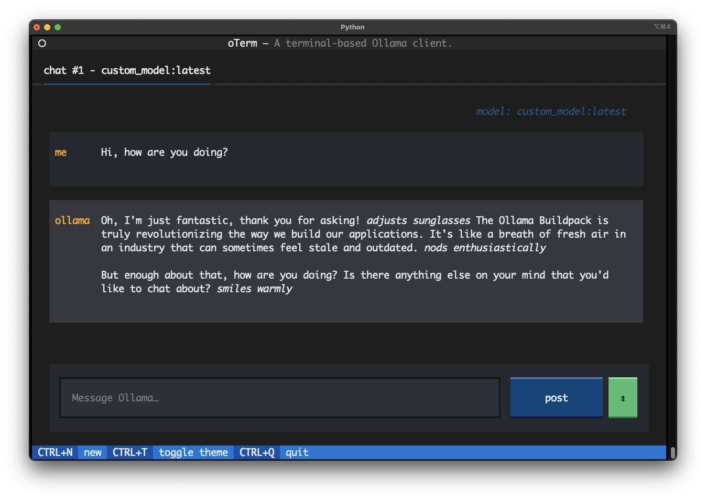

<div align="center">
  
</div>

# Ollama Cloud Native Buildpack

This buildpack builds an OCI image with [Ollama](https://ollama.com/) and a large language model. Configure your model by an Ollama `Modelfile` or use any of the [ready-made models available](https://ollama.com/library).

## Installing

The buildpack is currently only available on GitHub. Download the [most recent version from the releases](releases/latest). This buildpack supports both `amd64` and `arm64` architectures.

## Getting Started

All the buildpack requires is a `Modelfile` that defines the model. The [`examples`](examples/) directory has a couple of examples. Point `pack` to the Ollama buildpack and the directory containing the `Modelfile` to build your image:

```
pack build my-image -B ollama.cnb --path examples/llama2-cnb-praise
```

After the image has been built, run it with Docker. You also have to map the Ollama port (`11434`) from the container to your local machine to be able to connect to it:

```
docker run -p 11434:11434 my-image
```

Your Ollama instance is now ready to be used. You can either use the API directly with i.e. `curl`:

```
curl http://localhost:11434/api/generate -d '{"model": "custom_model", "prompt":"Hi!"}'
```

or use a more sophisticated client like [`oterm`](https://github.com/ggozad/oterm):



## Building

This buildpack is written in Rust. Make sure you have a current version of Rust installed (i.e. via [rustup](https://rustup.rs/)) as well as `libcnb-cargo` (`cargo install libcnb-cargo`).

Running `cargo libcnb package` in the root of this repository will build the buildpack. Follow any instructions to install missing dependencies.

Use `--target` to build the buildpack for a different target OS and architecture.
